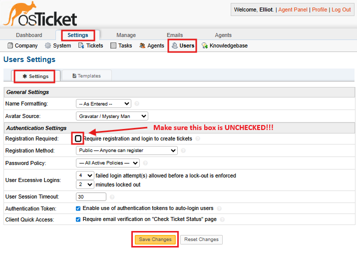
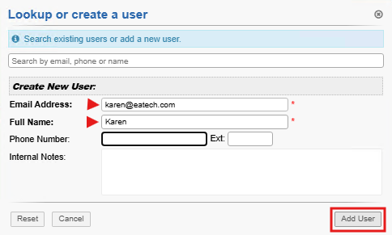
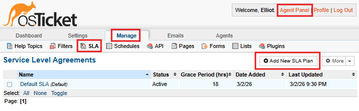
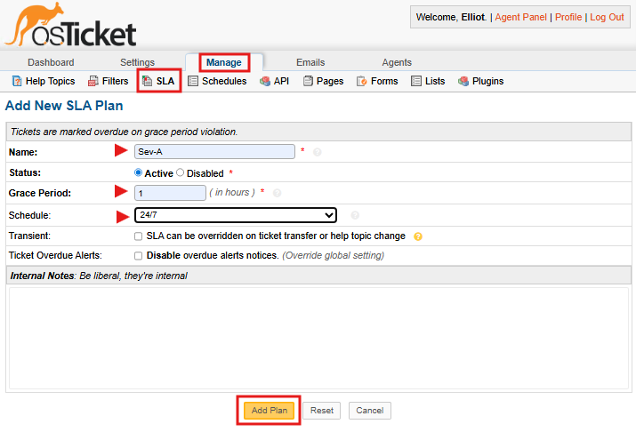
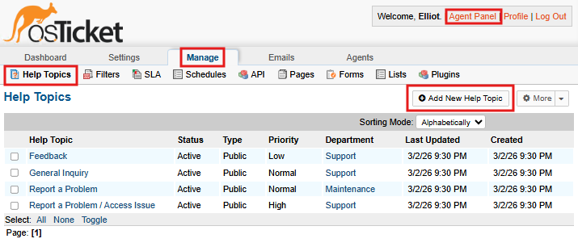
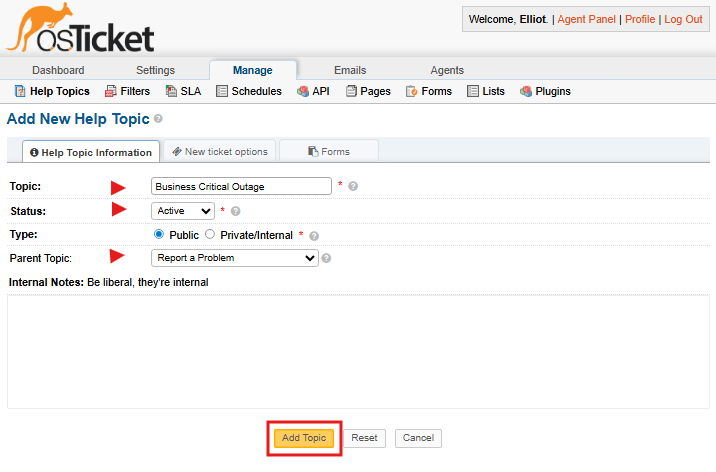

<h1>osTicket Post-Installation Setup Guide</h1>

<h2>About this Project</h2>

In this project we will define the important function setup the necessary configuration needed in osTicket before we start creating and  solving mock tickets in the next part of this laboratory exercise.

<h2>Environment & Technology Used</h2>

- Microsoft Windows Virtual Machine 
- Remote Desktop
- osTicket

<h2>Prerequisites</h2>

- Admin/Analyst Login Page:
     http://localhost/osTicket/scp/login.php

- End Users osTicket URL:
     http://localhost/osTicket 

<h2>Getting Started</h2>

<h3>1. Roles: Here we can assign different Permission to different Roles.</h3>
     
               
- Adding "Supreme Admin" as a new Role that grants a user full access to the sytem.
     - Admin Panel > Agents > Roles > click Add New Role.
          
             
     - Under Permission tab, check all the boxes from Tickets, Tasks and Knowledgebase tabs and hit "Add Role".
          
          
              
<h3>2. Departments: Allows different level of Ticket Visibility. ie. Help Desk vs SysAdmins vs Networking</h3>
       
                 
- Adding "SysAdmins" as a new Department. 
     - Admin Panel > Agents > Department > Select "Top Level Department" as Parent, type in "SysAdmins" under Name > hit Add New Role. 
          
          
                    
<h3>3. Teams: Allows user to pull Agents from different Departments to form a new team. </h3>

- Let's create a new team and name it "Online Banking".
     - Admin Panel > Agents > Teams > click Add New Team
          
     - Type "Online Banking" under Name, then click Create Team. *(We will add Members and Team Lead at the later part of this activity.)*
          
          
<h3>4. User Settings: This particular setting will allow anyone to create tickets. </h3>

- UNCHECK Require registration and loging to create tickets.
     - Admin Panel > Settings > User Settings > Uncheck Registration Required > Save Changes.
          

<h3>5. Agents: Adding new Agents/employees. Use the Agent's credential and information below. </h3>

- Name: Jane Doe | Email: jane@eatech.com | Department: SysAdmins | Role: Supreme Admin | Team: Online Banking | Username: jane | Password: Password1
- Name: John Doe | Email: john@eatech.com | Department: Support | Role: View only | Team: - | Username: john | Password: Password1
  
- To add new Agents go to...
     - Admin Panel > Agents > Add New
          
     - Under Account tab, enter the agent's personal information, including the username and password.
          
          
     - From the Access tab, choose SysAdmins and Supreme Admin from Primary Dept.
          
     - And at the Teams tab, choose SysAdmins and Supreme Admin from Primary Dept.
                     
     - Create another Agent and use the following details and credentials:

<h3>6. Configure Users/Customer</h3>

- Make sure you are on the Agent panel then, follow the steps below to add a User. 
     Agent Panel -> Users -> Add New 
               
               

<h3>7. Configuring Service Level Agreement. SLA's are defined by the grace period given to a ticket depending on it's severity.</h3>

To configure SLA's go to Admin Panel > Manage > SLA > After entering information on the required textbox, click Add Plan. Use the three level of SLA's below.

   - Sev-A (Grace Period: 1 hour, Schedule: 24/7)
   - Sev-B (Grace Period: 4 hours, Schedule: 24/7)
   - Sev-C (Grace Period: 8 hours, Business Hours) 
   
               
      
     
<h3>8. Configure Help Topics (For when users create a ticket).</h3>

To configure Help Topics go to Admin Panel > Manage > Help Topics >  Use the information below to add Help Topics.

   - Business Critical Outage
   - Personal Computer Issues
   - Equipment Request
   - Password Reset
   - Other
   
               
      

<h2>Finishing Up</h2>
<h3>That Concludes our initial setup for osTicket. In our next lab, we'll Ticket Lifecycle (Ticketing simulation).</h3>

For questions and concerns, please reach out to paulo@maglana.com*

